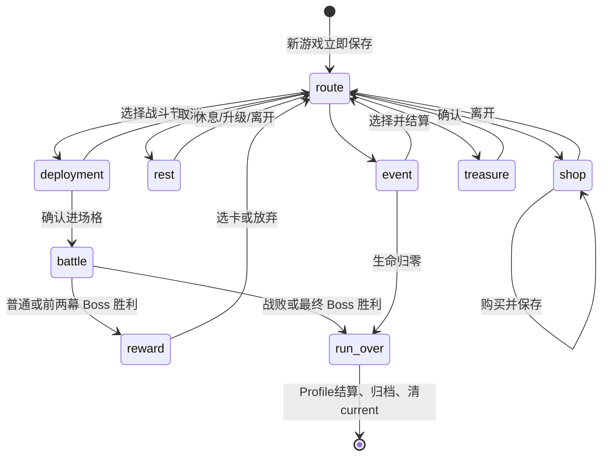

# 存档与整局生命周期

Run/Battle schema：**3**；Profile schema：**1**。新增持久化字段时一起修改 SaveCodec、SaveMigrator 和恢复测试。

## 状态流

RunState 保存独立于 seed 的 instance_id、flow_phase、pending_node_id/content_id/battle_id、pending_payload、settled_battle_ids、outcome、difficulty，以及牌组、地图、属性、遗物、RNG 子流快照。

节点 visited 与 pending **同次提交**。pending 未完成时不能进入其他节点，因此退出不能跳过战斗或刷新商店。

## 提交边界

- 新游戏立即保存；部署保存节点/预览而不推进正式 RNG，取消回 route。
- 战斗保存完整 BattleState：单位、牌区、状态、意图、事件序号、命令去重、延迟效果、遗物计数、RNG。setup 后及每次成功命令后，先 checkpoint 再播动画。
- 动画中退出：恢复将 RESOLVING 变为 resume_phase 并解锁，不重新结算或扣费；动画本身不保存。
- 商店保存商品与 sold/remove_used/heal_used，每次成功操作保存；事件存事件 ID，选择结算一次，不能免费支付负金币选项。
- 宝箱奖励与进入事务一并提交，pending 仅显示已得结果，恢复不重复发放。
- 胜利时持久变化、金币、遗物收益、Boss 推进、奖励选项与 RNG 一并保存；奖励页不再随机抽取。
- 领取/放弃奖励时检查 battle_id 和 offers，完成后清 pending 回 route。

UI 只调用 Session；不要直接更改 System 或缓存旧 RunState。提交会替换 session.state 对象。

## 去重与收尾

BattleResult 校验 run_instance_id、pending battle_id、settled_battle_ids，拒绝错误局/旧战斗/重复结果。相同 seed 两次新游戏也有不同 instance_id。

收尾顺序：写 current 终态 → Profile 副本以 instance_id 结算一次并保存 → 写 runs/history/id.json → 删除 current 的备份、临时文件、主文件。

中途失败返回 false 并提示重试。Profile.completed_runs 阻止已结算备份重新进入；主菜单 recover_ended_run 补做归档。新游戏替换活动局时记录 abandoned、0 回响；已结束旧局保留原结果。App.end_run 对活动局返回 false。

## 文件与恢复

| 文件 | 用途 |
|---|---|
| `user://runs/current.json` | 当前局 |
| `user://runs/current.bak` | 上一次有效存档 |
| `user://runs/current.json.tmp` | 未提交临时文件，加载忽略 |
| `user://runs/history/<id>.json` | 已结束的局，尚无内置删除历史 UI |
| `user://profile.json` / `profile.bak` | 局外进度与独立备份 |
| `user://settings.cfg` / `settings.cfg.bak` | ConfigFile 设置 |

Windows 默认 user:// 为 `%APPDATA%\Godot\app_userdata\mobius`。验证脚本改用 `.validation/userdata`，不访问玩家数据。

Run/Profile JSON 外层为 payload 字符串和 SHA-256，内部是值状态。支持读取早期未封装 JSON。校验用于意外损坏检测，不是加密或防作弊。

写入：临时文件写完/flush → 重新读取校验 → 备份有效主档 → 替换主档。Windows 替换失败且主档不存在时尝试恢复备份。突然断电可能回退至上一个保存点，不能保证最后的内存操作已落盘。

读取：验证主档 → 无效/缺失时读备份 → 恢复主档。残留 tmp 不当作已提交进度。主档版本更高时明确拒绝，不用旧备份冒充成功。

写盘失败不撤销已成功的内存玩法事务。弹窗“重试保存”只重新写盘，不重执行购买/奖励；成功前退出会丢失这段内存进度。备份恢复也可能回退一个保存点。

## 兼容性边界

v1/v2 升至 v3，缺事务字段默认回 route。早期存档没有战斗/商店/奖励现场，无法凭空补回；旧档已跳过节点的情况需重新开局验证。

BattleCheckpoint 根据当前 Catalog 重绑稳定 ID；删改内容 ID 或更换规则可能让旧局无法继续或改变结果。当前不保证任意内容版本之间的战斗重放兼容，发布前需冻结内容版本或实现迁移。

验证入口：`tests/rules/test_run_lifecycle.gd`、`test_save_recovery.gd`、`test_save_codec.gd` 和 `tests/ui_smoke.gd`。
